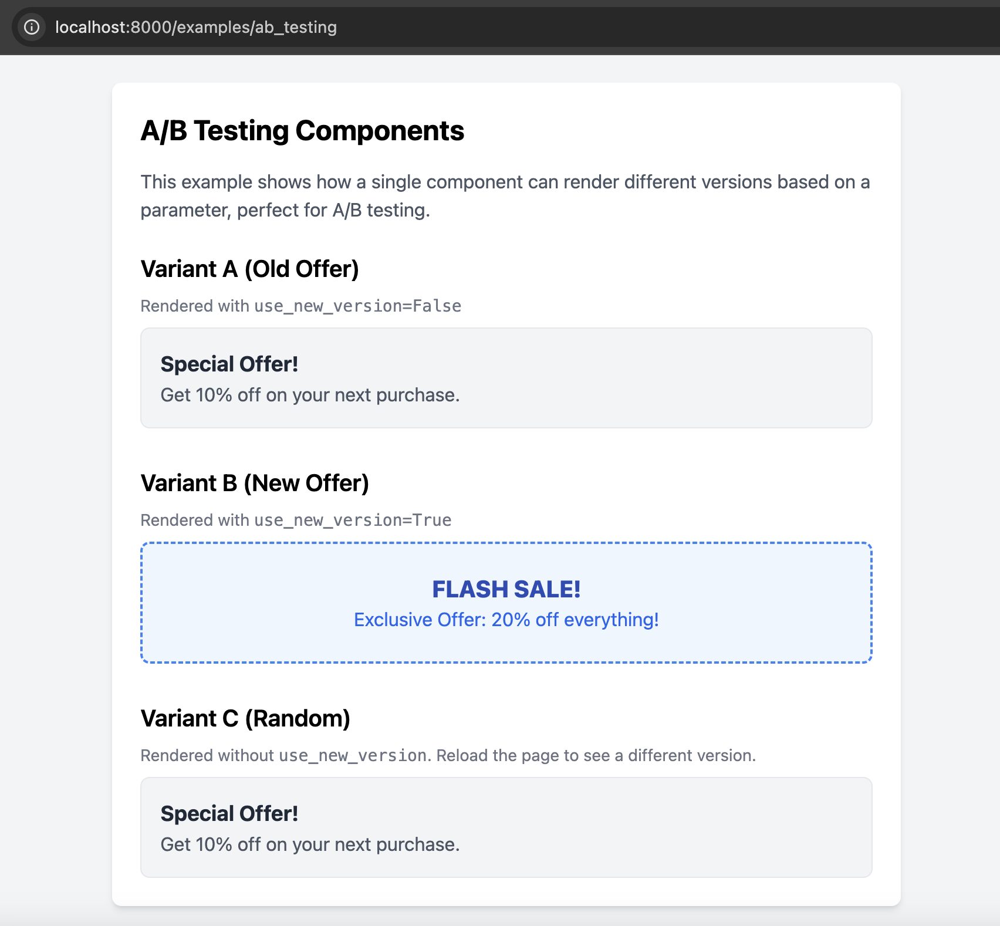

# A/B Testing

A/B testing, phased rollouts, or other advanced use cases can be made easy by dynamically rendering different versions of a component.

Use the [`Component.on_render()`](../../reference/api/#django_components.Component.on_render) hook, to decide which version to render based on a component parameter (or a random choice).



## How it works

[`Component.on_render()`](../../reference/api/#django_components.Component.on_render) is called when the component is being rendered. This method can completely override the rendering process, so we can use it to render another component in its place.

```py
class OfferCard(Component):
    ...
    def on_render(self, context, template):
        # Pass all kwargs to the child component
        kwargs_for_child = self.kwargs._asdict()
        use_new = kwargs_for_child.pop("use_new_version")

        # If version not specified, choose randomly
        if use_new is None:
            use_new = random.choice([True, False])

        if use_new:
            return OfferCardNew.render(context=context, kwargs=kwargs_for_child)
        else:
            return OfferCardOld.render(context=context, kwargs=kwargs_for_child)
```

In the example we render 3 versions of the `OfferCard` component:

- Variant that always shows an "old" version with `use_new_version=False`
- Variant that always shows a "new" version with `use_new_version=True`.
- Variant that randomly shows one or the other, omitting the `use_new_version` flag.

All extra parameters are passed through to the underlying components.

**Variant A (Old)**

```django

```

**Variant B (New)**

```django

```

**Variant C (Random)**

```django

```

## Definition

```djc_py
--8<-- "docs/examples/ab_testing/component.py"
```

## Example

To see the component in action, you can set up a view and a URL pattern as shown below.

### `views.py`

```djc_py
--8<-- "docs/examples/ab_testing/page.py"
```

### `urls.py`

```python
from django.urls import path

from examples.pages.ab_testing import ABTestingPage

urlpatterns = [
    path("examples/ab_testing", ABTestingPage.as_view(), name="ab_testing"),
]
```
