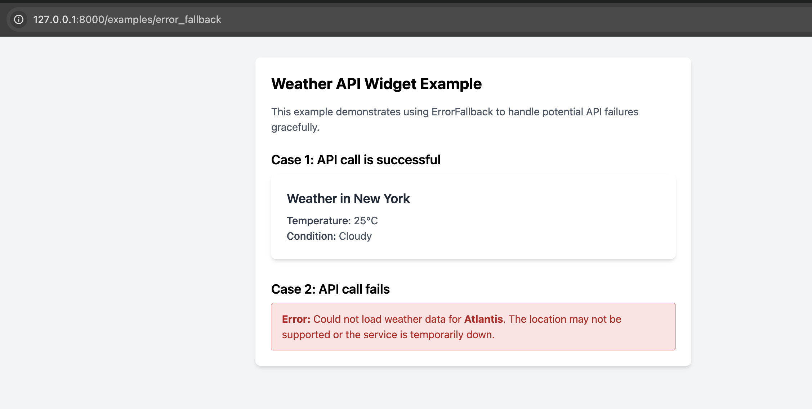

# Error handling

The [`ErrorFallback`](../../reference/components/#django_components.components.error_fallback.ErrorFallback) component catches errors during component rendering and displays fallback content instead. This is similar to React's [`ErrorBoundary`](https://react.dev/reference/react/Component#catching-rendering-errors-with-an-error-boundary) component.

In this scenario, we have a `WeatherWidget` component that simulates fetching data from a weather API,
which we wrap in the built-in [`ErrorFallback`](../../reference/components/#django_components.components.error_fallback.ErrorFallback) component.

We have two cases:

1. API call succeeds. The `WeatherWidget` component renders the weather information as expected.
2. API call fails. The `ErrorFallback` component catches the error and display a user-friendly message instead of breaking the page.

```django

    
        
    
    
        <p style="color: red;">
            Could not load weather data for <strong>Atlantis</strong>.
            The location may not be supported or the service is temporarily down.
        </p>
    

```



## API

For full API reference, see [`ErrorFallback`](../../reference/components/#django_components.components.error_fallback.ErrorFallback).

## Definition

```djc_py
--8<-- "docs/examples/error_fallback/component.py"
```

## Example

To see the component in action, you can set up a view and URL pattern as shown below.

### `views.py`

```djc_py
--8<-- "docs/examples/error_fallback/page.py"
```

### `urls.py`

```python
from django.urls import path

from examples.pages.error_fallback import ErrorFallbackPage

urlpatterns = [
    path("examples/error_fallback", ErrorFallbackPage.as_view(), name="error_fallback"),
]
```
