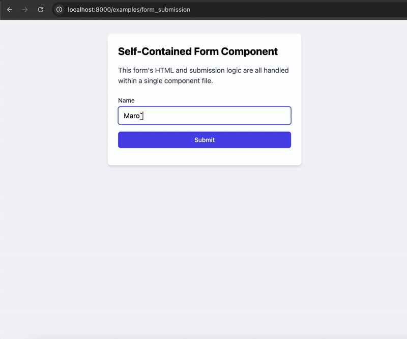

# Form Submission

Handle the entire form submission flow in a single file. From UI definition to server-side handler, without Django's `Form` class and without modifying `urlpatterns`.

1. Define the form to submit in the HTML as a `<form>`.

2. Add a [`View.post()`](../../reference/api#django_components.ComponentView.post) method on the same component that defines the `<form>`, to define how to process the form data and return a partial HTML response.

3. Obtain the URL to submit the form to and set it as the `action` attribute of the `<form>`. You don't need to go to your `urlpatterns`. The submission URL is dynamically generated using [`get_component_url()`](../../reference/api#django_components.get_component_url).

The `ContactFormComponent` renders a simple form. After submission, it receives a partial HTML response and appends a "thank you" message below the form.



## Definition

```djc_py
--8<-- "docs/examples/form_submission/component.py"
```

## Example

To see the component in action, you can set up a view and a URL pattern as shown below.

### `views.py`

```djc_py
--8<-- "docs/examples/form_submission/page.py"
```

### `urls.py`

```python
from django.urls import path

from examples.pages.form_submission import FormSubmissionPage

urlpatterns = [
    path("examples/form_submission", FormSubmissionPage.as_view(), name="form_submission"),
]
```
