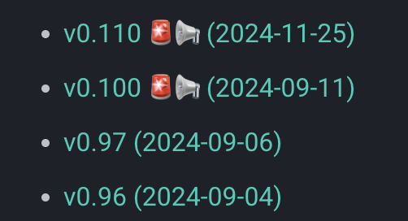
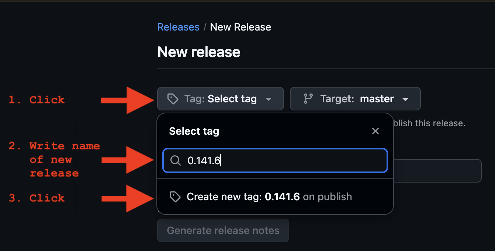
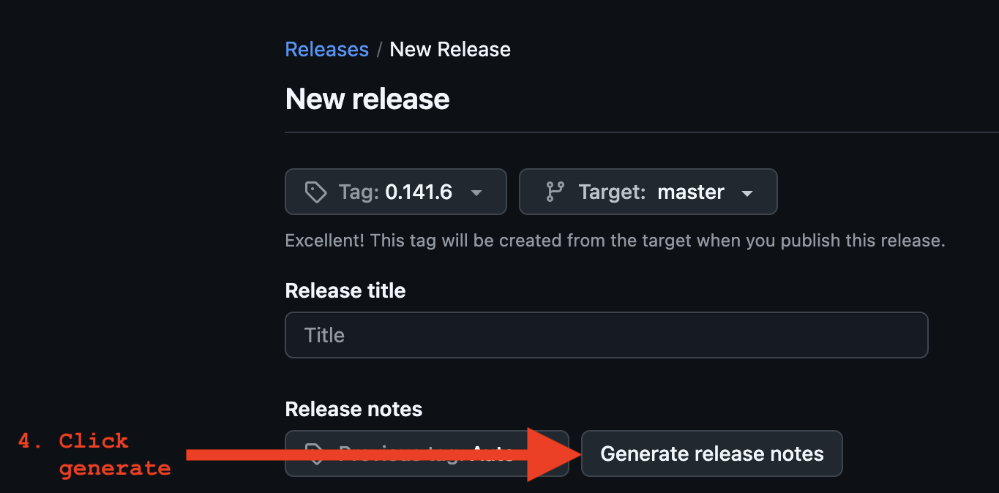
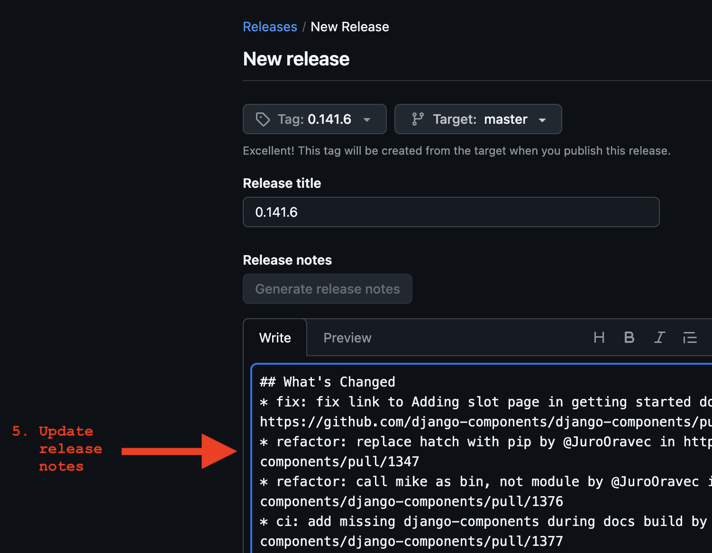
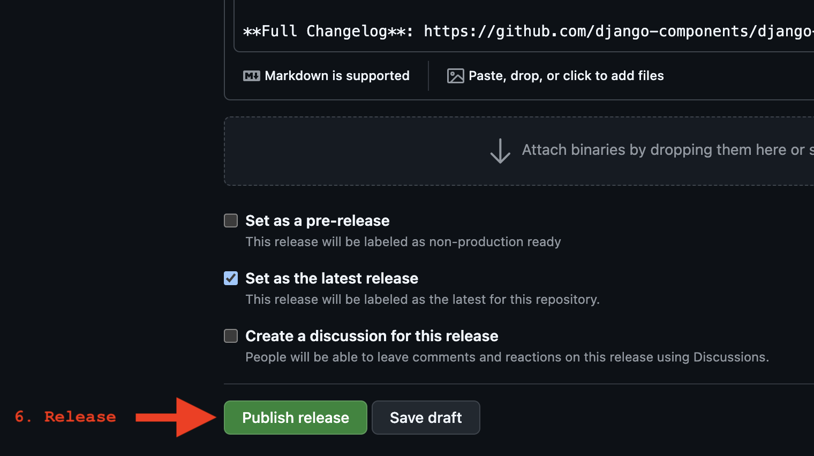
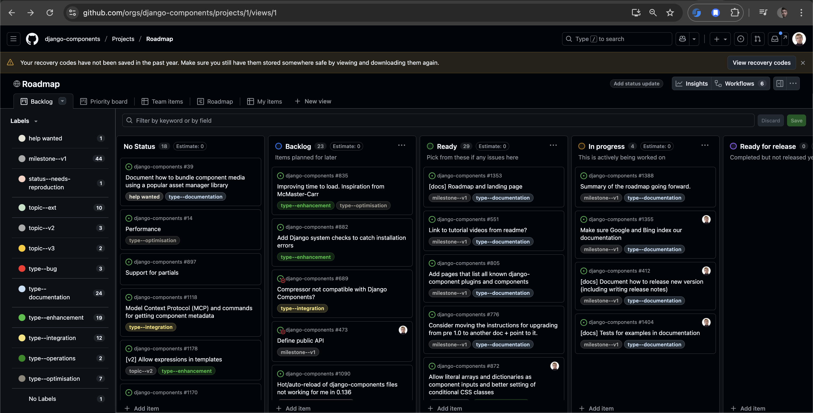
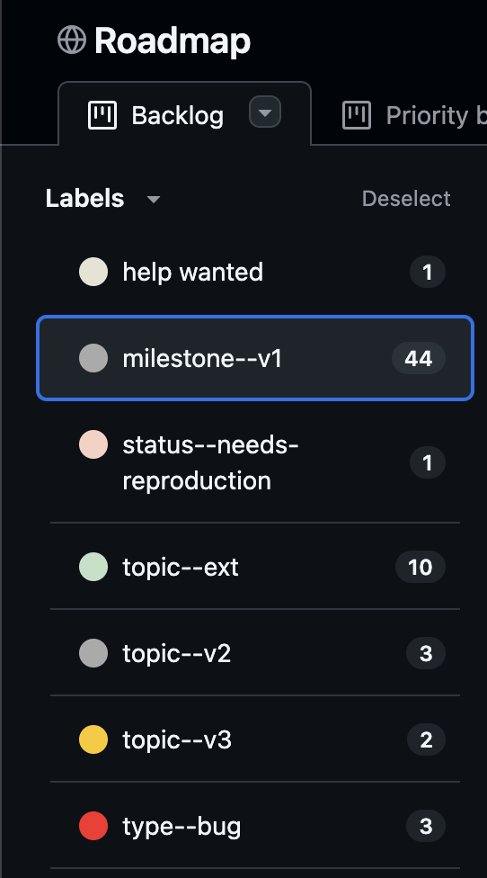

## Local installation

Start by forking the project by clicking the **Fork button** up in the right corner in the [GitHub](https://github.com/django-components/django-components).
This makes a copy of the repository in your own name. Now you can clone this repository locally and start adding features:

```sh
git clone https://github.com/<your GitHub username>/django-components.git
cd django-components
```

### Installing uv

This project uses [uv](https://github.com/astral-sh/uv) for dependency management. Install uv first:

**On macOS and Linux:**
```sh
curl -LsSf https://astral.sh/uv/install.sh | sh
```

**On Windows:**
```powershell
powershell -ExecutionPolicy ByPass -c "irm https://astral.sh/uv/install.ps1 | iex"
```

Or using pip:
```sh
pip install uv
```

For more installation options, see the [uv documentation](https://docs.astral.sh/uv/getting-started/installation/).

### Installing dependencies

To install all development dependencies (including the package itself in editable mode):

```sh
uv sync --group dev
```

This will:

- Create a virtual environment (if one doesn't exist)
- Install all project dependencies and dev dependencies
- Install the package in editable mode
- Generate or update `uv.lock` file

To install dependencies for a specific group:

- `uv sync --group dev` - Development dependencies (for local development)
- `uv sync --group ci` - CI dependencies (for running tests in CI)
- `uv sync --group docs` - Documentation dependencies (for building docs)

### Managing dependencies

**Adding a new dependency:**
```sh
# Add to main dependencies
uv add <package-name>

# Add to dev dependencies
uv add --group dev <package-name>

# Add to docs dependencies
uv add --group docs <package-name>
```

**Removing a dependency:**
```sh
uv remove <package-name>
# Or for a specific group:
uv remove --group dev <package-name>
```

**Updating dependencies:**
```sh
# Update all dependencies to latest compatible versions
uv lock --upgrade

# Then sync to apply updates
uv sync --group dev
```

**Switching between environments:**
```sh
# Activate the virtual environment
source .venv/bin/activate  # On macOS/Linux
# or
.venv\Scripts\activate  # On Windows

# Or use uv run to run commands in the environment
uv run pytest
uv run ruff check .
```

## Running tests

Now you can run the tests to make sure everything works as expected:

```sh
pytest
```

The library is also tested across many versions of Python and Django. To run tests that way:

```sh
pyenv install -s 3.10
pyenv install -s 3.11
pyenv install -s 3.12
pyenv install -s 3.13
pyenv install -s 3.14
pyenv local 3.10 3.11 3.12 3.13 3.14
tox -p
```

To run tests for a specific Python version, use:

```sh
tox -e py310
```

NOTE: See the available environments in `tox.ini`.

### Selecting tests by marker

The suite is split into three lanes via pytest markers. The default test run skips the two heavyweight lanes:

- `@pytest.mark.e2e` — browser-based end-to-end tests. Applied automatically by the `@with_playwright` decorator, so you don't tag tests by hand.
- `@pytest.mark.benchmark_snapshot` — heavy benchmark snapshot tests (the four `test_benchmark_*.py` files). Applied automatically by `pytest_collection_modifyitems` in [`tests/conftest.py`](https://github.com/django-components/django-components/blob/master/tests/conftest.py) based on filename, so new tests added to those files are picked up without further configuration.

You can target a single lane:

```sh
# Just the fast unit tests (the default — skips E2E and benchmark)
pytest -m "not e2e and not benchmark_snapshot"

# Just the E2E tests
tox -e e2e

# Just the benchmark snapshot tests
tox -e benchmark_snapshot
```

The default `tox` env (e.g. `tox -e py314-django52`) runs the unit-test lane in parallel with `pytest-xdist` (`-n auto`). One exception: `tests/test_templatetags_provide.py` is force-run serially because it asserts on shared template-cache state that the parallel workers would race on.

## Linting and formatting

To check linting rules, run:

```sh
ruff check .
# Or to fix errors automatically:
ruff check --fix .
```

To format the code, run:

```sh
ruff format --check .
# Or to fix errors automatically:
ruff format .
```

To validate with Mypy, run:

```sh
mypy .
```

You can run these through `tox` as well:

```sh
tox -e mypy,ruff
```

## Playwright tests

We use [Playwright](https://playwright.dev/python/docs/intro) for end-to-end tests.

Tests decorated with `@with_playwright` automatically run across all major browsers: Chromium, Firefox, and WebKit. This ensures cross-browser compatibility.

Test functions must include the `browser` and `browser_name` fixtures to work correctly.

```py
from django_components.testing import djc_test
from tests.e2e.utils import BrowserType, with_playwright
from playwright.async_api import Browser

@djc_test
class MyTest:
    @with_playwright
    async def test_script_loads(self, browser: Browser, browser_name: BrowserType):
        page = await browser.new_page()
        await page.goto(f"{TEST_SERVER_URL}/my-page")
        assert page.content() == "My page"
```

You will need to install Playwright to run these tests. If you've already run `uv sync --group dev`, Playwright should be installed. Then install the browsers:

```sh
# All three browsers (matches the default local behavior)
playwright install chromium firefox webkit --with-deps

# Or, if you only want to run against one browser, install just that one
playwright install chromium --with-deps
```

After Playwright is ready, run the E2E lane:

```sh
tox -e e2e
# Or, without tox:
pytest -m e2e
```

### Selecting which browsers E2E tests run against

By default, `@with_playwright` parametrizes each test across Chromium, Firefox, and WebKit. To limit which browsers are used (e.g. when you've only installed one), set the `DJC_TEST_BROWSERS` environment variable:

```sh
# Only run against Chromium
DJC_TEST_BROWSERS=chromium tox -e e2e

# Run against Chromium and Firefox
DJC_TEST_BROWSERS=chromium,firefox pytest -m e2e
```

The PR-time `e2e` lane sets `DJC_TEST_BROWSERS=chromium` for speed. A separate weekly workflow (`.github/workflows/tests-cross-browser.yml`) runs the suite against Chromium, Firefox, and WebKit in parallel and catches browser-specific regressions. Running locally without the variable uses all three browsers.

### E2E Test Server Configuration

When writing E2E tests, it consists of 2 parts:

1. Define endpoints on a Django test server that runs during tests and serves the pages/components/files that we want to fetch and render in the browser.
2. The actual code that uses Playwright browser automation to test the logic.

The Django test server is defined `tests/e2e/testserver/`.

But this means splitting your logic across 2 places. To avoid this, you can co-locate the code with your test file using the `server()` function pattern.

Define a `server()` function in your test file that returns a dictionary mapping URL paths to view functions. The Django test server will automatically discover and register these during startup:

```py
# tests/test_component_js_e2e.py
from django.http import HttpResponse
from django.template import Context, Template
from django_components import Component, register, types
from django_components.testing import djc_test
from tests.e2e.utils import TEST_SERVER_URL, with_playwright

def server():
    """
    Define server-side components and views for E2E tests.
    
    This function is automatically discovered and called by the testserver
    to register URL patterns, views, and components.
    """
    @register("my_component")
    class MyComponent(Component):
        template: types.django_html = """
            <div id="my-component">Hello</div>
        """
        
        js: types.js = """
            console.log("Component loaded");
        """
    
    def my_view(_request):
        template_str: types.django_html = """
            
            <!DOCTYPE html>
            <html>
                <head>
                    
                </head>
                <body>
                    
                    
                </body>
            </html>
        """
        template = Template(template_str)
        rendered = template.render(Context({}))
        return HttpResponse(rendered)
    
    return {
        "/my-page": my_view,
    }

@djc_test
class MyTest:
    @with_playwright
    async def test_my_component(self, browser: Browser, browser_name: BrowserType):
        page = await browser.new_page()
        await page.goto(f"{TEST_SERVER_URL}/my-page")
        # Your test assertions here
```

This pattern eliminates the need to manually update `testserver/urls.py`, `testserver/views.py`, and `testserver/components/__init__.py` when adding new E2E tests.

## Snapshot tests

Some tests rely on snapshot testing with [syrupy](https://github.com/syrupy-project/syrupy) to test the HTML output of the components.

If you need to update the snapshot tests, add `--snapshot-update` to the pytest command:

```sh
pytest --snapshot-update
```

Or with tox:

```sh
tox -e py310 -- --snapshot-update
```

## How CI runs your tests

GitHub Actions splits the test suite across multiple jobs in [`.github/workflows/tests.yml`](https://github.com/django-components/django-components/blob/master/.github/workflows/tests.yml). The split exists so that expensive setup (Playwright browsers, heavy benchmark renders) happens once per CI run instead of once per Python/OS cell.

### The job lanes

| Job | Matrix | When | What it runs | Tox env |
| --- | --- | --- | --- | --- |
| `build` | Ubuntu × Python 3.10–3.14, plus Windows × Python 3.10 and 3.14 | Every push / PR | Unit tests in parallel with `pytest-xdist`. Skips E2E and benchmark markers. No Playwright install. | `tox` |
| `e2e` | Ubuntu × Python 3.14 | Every push / PR | Only `@pytest.mark.e2e` tests. Installs Chromium only. Sets `DJC_TEST_BROWSERS=chromium`. | `tox -e e2e` |
| `benchmark_snapshots` | Ubuntu × Python 3.14 | Every push / PR | Only `@pytest.mark.benchmark_snapshot` tests. | `tox -e benchmark_snapshot` |
| `coverage` | Ubuntu × Python 3.14 | Every push / PR | Unit-test lane with coverage, fails under 75%. | `tox -e coverage` |
| `ruff`, `mypy` | Ubuntu × Python 3.14 | Every push / PR | Lint and type-check. | `tox -e ruff`, `tox -e mypy` |
| `e2e_cross_browser` | Ubuntu × Python 3.14 × `{chromium, firefox, webkit}` | Weekly cron (Mon 06:00 UTC) + manual dispatch | E2E suite against each browser, one cell per browser. Chromium is included as a baseline. On scheduled failures, files or comments on a tracking issue labeled `ci-cross-browser-failure`. See [`tests-cross-browser.yml`](https://github.com/django-components/django-components/blob/master/.github/workflows/tests-cross-browser.yml). | `tox -e e2e` (with `DJC_TEST_BROWSERS=<browser>`) |

### When the weekly cross-browser run fails

When the scheduled run (not a manual dispatch) fails, a notification job opens or updates a GitHub issue labeled `ci-cross-browser-failure`. The first failure creates the issue; subsequent failures add a comment to the same issue instead of opening a new one. Close the issue manually once the cross-browser run is green again — the next failure after the issue is closed will open a new one.

Triage flow when you see one of these issues:

1. Open the linked workflow run and check which matrix cells (chromium / firefox / webkit) failed.
2. If **only firefox or webkit** failed, the bug is browser-specific. Reproduce locally with `DJC_TEST_BROWSERS=firefox tox -e e2e` (after installing that browser).
3. If **chromium also failed**, the PR-time `e2e` lane would have caught the same thing on the next push, so the most likely cause is flakiness or an environmental regression (Playwright version, browser binary, runner image).

### Windows coverage is smoke-only

The Windows matrix runs Python 3.10 and 3.14 only, not the full Python range. The intent is to catch path-handling regressions on Windows without paying full matrix cost. A Windows-specific failure on Python 3.11/3.12/3.13 will not appear in CI.

### How tests get sorted into lanes

- E2E tests get the `e2e` marker from the `@with_playwright` decorator, which also pulls in the `django_dev_server` fixture. So writing `@with_playwright` is the only thing you need to do to route a test into the E2E lane.
- Benchmark tests get the `benchmark_snapshot` marker automatically based on file name (the four `test_benchmark_*.py` files), via a `pytest_collection_modifyitems` hook in `tests/conftest.py`. Adding a new test inside one of those files is enough.
- Everything else is a "unit test" and runs in the default lane.

### Local equivalents

The same `tox` envs CI uses are available locally:

```sh
tox -e py314-django52       # unit-test lane, single cell
tox -e e2e                  # E2E lane (needs playwright install first)
tox -e benchmark_snapshot   # benchmark snapshot lane
tox -e coverage             # unit-test lane with coverage
tox -e ruff,mypy            # lint and type-check
```

Running `pytest` directly (no `tox`) runs everything in your local venv, including E2E and benchmark tests, so plain `pytest` does *more* than the CI unit-test lane does. Use `pytest -m "not e2e and not benchmark_snapshot"` to match the CI unit lane.

## Dev server

How do you check that your changes to django-components project will work in an actual Django project?

Use the [sampleproject](https://github.com/django-components/django-components/tree/master/sampleproject/) demo project to validate the changes:

1. Navigate to [sampleproject](https://github.com/django-components/django-components/tree/master/sampleproject/) directory:

    ```sh
    cd sampleproject
    ```

2. Install dependencies from the [requirements.txt](https://github.com/django-components/django-components/blob/master/sampleproject/requirements.txt) file:

    ```sh
    # Using pip
    pip install -r requirements.txt
    # Or using uv
    uv pip install -r requirements.txt
    ```

3. Link to your local version of django-components:

    ```sh
    # Using pip
    pip install -e ..
    # Or using uv
    uv pip install -e ..
    ```

    !!! note

        The path to the local version (in this case `..`) must point to the directory that has the `pyproject.toml` file.

4. Start Django server:

    ```sh
    python manage.py runserver
    ```

Once the server is up, it should be available at <http://127.0.0.1:8000>.

To display individual components, add them to the `urls.py`, like in the case of <http://127.0.0.1:8000/greeting>

## Building JS code

django_components uses a bit of JS code to:

- Manage the loading of JS and CSS files used by the components
- Allow to pass data from Python to JS

When you make changes to this JS code, you also need to compile it:

1. Navigate to `src/django_components_js`:

    ```sh
    cd src/django_components_js
    ```

2. Install the JS dependencies

    ```sh
    npm install
    ```

3. Compile the JS/TS code:

    ```sh
    python build.py
    ```

    The script will combine all JS/TS code into a single `.js` file, minify it,
    and copy it to `django_components/static/django_components/django_components.min.js`.

## Documentation website

The documentation site is a Django project under `docs_site/` that uses
django-components to render markdown pages into static HTML. The site is
pre-rendered at build time and deployed to GitHub Pages.

All commands run from inside `docs_site/`:

```sh
cd docs_site
```

While editing, run the dev server for live preview. It renders each page on
the fly through the same pipeline as the build, so you just edit a markdown
file and reload:

```sh
uv run python manage.py docs_serve   # open http://127.0.0.1:8000/
```

> Search does not work under `docs_serve`. Search is powered by a Pagefind
> index that is generated from the *built* site, which the live preview never
> produces, so the search box falls back to a "search with Google" link. To
> try search, serve the built site instead (see below).

Build the whole site to `./site/` (gitignored):

```sh
uv run python manage.py build_docs
```

To preview the site exactly as it is deployed - with the Pagefind search index
and the collected `/static/` assets - build it and serve it over plain HTTP:

```sh
uv run python manage.py docs_serve_built   # builds, then serves http://127.0.0.1:8000/docs/
```

This is the way to test anything that only works against the built site, above
all search. Pass `--no-build` to re-serve the existing `./site/` without
rebuilding, `--port` to change the port, or `--versions` to also fake a
multi-version tree for testing the version picker (see Versioning below).

The full gate that CI runs on every pull request (and that you can run locally)
builds the whole site to a temp dir and runs every guardrail - links, anchors,
fences, nav drift - in strict mode:

```sh
uv run python manage.py docs_build_check
```

The build pipeline renders each markdown file through four passes:

1. Fence protection wraps code blocks in `` so Django doesn't execute template tags inside code examples
2. Django template engine expands ``, ``, and other tags
3. python-markdown + pymdownx converts the expanded markdown to HTML with syntax highlighting, admonitions, TOC, etc.
4. DocPage component wraps the content in a full HTML page with `<head>` metadata

### Versioning

Each released version is built once and committed under
`docs_site/versions/<version>/`, with a `versions.json` manifest and `latest/`
redirect stubs alongside it; the header's version picker reads that manifest.
CI does this for you, so you rarely run these by hand:

```sh
# Build one version snapshot (what a release tag runs in CI):
uv run python manage.py build_docs --docs-version 0.151.0 --alias latest

# Validate the committed version tree (manifest, aliases, cross-version links):
uv run python manage.py docs_versions_check

# Rebuild many versions from git tags (one-off bootstrap or recovery):
uv run python manage.py docs_build_all     # --dry-run to preview the selection
```

`docs_build_all` reads `docs_versions.toml` for which tags to build; tags from
before the docs builder existed are skipped.

To exercise the version picker locally - switching between `latest`, `dev`, and
specific versions - fake a few versions from the current content and serve them:

```sh
uv run python manage.py docs_serve_built --versions   # demo tree (current + older + dev)
```

The site deploys automatically via GitHub Actions, which assemble the full tree
(current build at the root + the published versions under `/v/*`) and publish it
to GitHub Pages:

- A **release tag** builds and commits that version's snapshot under
  `docs_site/versions/<version>/`, then deploys.
- A push to **`master`** builds and deploys a fresh `dev` snapshot - but `dev` is
  *never committed* (only release tags commit).

Two things worth knowing: the committed `versions/` tree keeps every version, but
the deploy publishes only the newest N (GitHub Pages caps a site at 1 GB and the
historical builds are large) - set by `[publish] window` in `docs_versions.toml`.
See [`docs_site/README.md`](https://github.com/django-components/django-components/blob/master/docs_site/README.md)
for the full versioning, deploy, 1 GB-limit, and base-path model.

### Writing docstrings

Public-API docstrings ship in two places at once: a contributor's IDE-hover
popup (VSCode/Pylance, PyCharm) and the rendered docs site (via the
[griffe](https://mkdocstrings.github.io/griffe/)-driven API-reference generator
under `docs_site/apps/docs/reference/`). The following convention is what works
in both, with the smallest set of rules worth memorizing.

**The 4 rules:**

1. **Use Google-style sections.** `Args:`, `Returns:`, `Raises:`,
   `Yields:`, `Examples:`, `Note:`, `Warning:`, `Attributes:`. Indent the
   body four spaces. Both IDEs and griffe parse these into structured
   display.

    Do **not** write `**Args:**` (markdown-bold pseudo-section): griffe's
    Google parser ignores that form, so the parameters end up unparsed in
    the docs build.

2. **Single backticks for code, literals, and symbol mentions where a link
   isn't needed.** Single backticks NEVER produce a link in the docs
   build, only monospace, the same as IDEs. This keeps backticks
   unambiguous: no surprise linkification, no "literal or reference?"
   confusion.

3. **Bracket cross-refs `[X][]` (or `[link text][Symbol]`) when a link IS
   the goal.** Don't write `[Component](api.md#Component)` by hand:
   that couples the docstring to the docs URL layout, which has bitten us
   before. Bracket cross-refs let the docs builder resolve the link.

    The lookup key is the short form. So
    `[Component][Component]`, `[Component.inject()][Component.inject]`,
    `[ComponentsSettings.dirs][ComponentsSettings.dirs]`: never
    `[X][django_components.X]` or
    `[X][app_settings.ComponentsSettings.dirs]`. Strip the package and
    module prefixes; keep `Class.attr` form for attributes.

    The IDE shows `[Component][]` as plain text (no link). That's the
    tradeoff we accept for keeping backticks unambiguous.

4. **Prefer markdown alternatives to raw HTML and Material admonitions,
   most of the time.** Replace `<i>New in version X</i>` with
   `*New in version X.*`. Replace `!!! warning` with `> **Warning:** ...`
   when a regular blockquote conveys the same weight. These render in
   both IDE hover and the docs build.

    **Escape hatch:** when a docstring genuinely benefits from the
    Material admonition treatment (a long worked example, a load-bearing
    "this will silently corrupt your data" callout), keep the
    `!!! warning` form. The IDE shows plain text but the build renders
    the styled callout. Don't dilute the load-bearing callouts by using
    them for everything.

**External links:** use full URLs. `[Django Context](https://docs.djangoproject.com/...)`.
IDEs make them clickable. The build passes them through.

#### Worked example: bad vs good

❌ Bad: bold pseudo-section, hand-typed URL link, raw HTML for emphasis.

```python
def render(self, *args, **kwargs):
    """
    Render the component.

    <i>Available since v0.50.</i>

    **Args:**

    - `args`: Positional args passed to the [`Component`](api.md#django_components.Component).
    - `kwargs`: Keyword args.
    """
```

✅ Good: Google `Args:` section, bracket cross-ref, italic markdown.

```python
def render(self, *args, **kwargs):
    """
    Render the component.

    *Available since v0.50.*

    Args:
        args: Positional args passed to the [`Component`][Component].
        kwargs: Keyword args.
    """
```

The IDE renders both reasonably; only the second produces a clickable
cross-ref AND a structured `Args:` block in the docs build.

#### Scope

The convention is forward-looking: it's how new docstrings should be
written. Existing docstrings were swept once for the structural blockers
(the hand-typed `[X](api.md#...)` form and the `**Args:**` pseudo-section
form) when the docs migration started; advanced syntaxes that already
exist in docstrings (Material admonitions, raw HTML) are kept until a
load-bearing reason argues to change them.

### Examples

The [examples page](../../../examples/) is populated from entries in `docs/examples/`.

These examples have special folder layout:

```text
|- docs/
  |- examples/
    |- <example_name>/
      |- component.py - The component definition
      |- page.py      - The page view for the example
      |- test_example_<example_name>.py - Tests
      |- README.md    - Component documentation
      |- images/      - Images used in README
```

This allows us to keep the examples in one place, and define, test, and document them.

**Previews** - There's a script in `sampleproject/examples/utils.py` that picks up the `component.py` and `page.py` files, making them previewable in the dev server (`http://localhost:8000/examples/<example_name>`).

To see all available examples, go to `http://localhost:8000/examples/`.

The examples index page displays a short description for each example. These values are taken from a top-level `DESCRIPTION` string variable in the example's `component.py` file.

**Tests** - Use the file format `test_example_<example_name>.py` to define tests for the example. These tests are picked up when you run pytest.

#### Adding examples

Let's say we want to add an example called `form`:

1. Create a new directory in `docs/examples/form/`
2. Add actual implementation in `component.py`
3. Add a live demo page in `page.py`
4. Add tests in `test_example_form.py`
5. Write up the documentation in `README.md`
6. Link to that new page from `docs/examples/index.md`.
7. Update `docs/examples/.nav.yml` to update the navigation.

### People page

The [people page](https://django-components.github.io/django-components/dev/community/people/) is regularly updated with stats about the contributors and authors. This is triggered automatically once a month or manually via the Actions tab.

See [`.github/workflows/maint-docs-people.yml`](https://github.com/django-components/django-components/blob/master/.github/workflows/maint-docs-people.yml) for more details.

## Publishing

We use Github actions to automatically publish new versions of django-components to PyPI when a new tag is pushed. [See the full workflow here](https://github.com/django-components/django-components/blob/master/.github/workflows/publish-to-pypi.yml).

### Commands

We do not manually release new versions of django-components. Commands below are shown for reference only.

To package django-components into a distribution that can be published to PyPI, run `build`:

```sh
# Install pypa/build
python -m pip install build --user
# Build a binary wheel and a source tarball
python -m build --sdist --wheel --outdir dist/ .
```

To then publish the contents of `dist/` to PyPI, use `twine` ([See Python user guide](https://packaging.python.org/en/latest/tutorials/packaging-projects/#uploading-the-distribution-archives)):

```sh
twine upload --repository pypi dist/* -u __token__ -p <PyPI_TOKEN>
```

### Release new version

Let's say we want to release a new version `0.141.6`. We need to:

1.  Bump the `version` in `pyproject.toml` to the desired version.

    ```toml
    [project]
    version = "0.141.6"
    ```

2.  Create a summary of the changes in `CHANGELOG.md` at the top of the file.

    When writing release notes for individual changes, it's useful to write them like mini announcements:

    - Explain the context
    - Then the change itself
    - Then include an example

    ```md
    # Release notes

    ## v0.141.6

    _2025-09-24_

    #### Fix

    - Tests - Fix bug when using `@djc_test` decorator and the `COMPONENTS`
      settings are set with `ComponentsSettings`
      See [#1369](https://github.com/django-components/django-components/issues/1369)
    ```

    !!! note

        When you include the release date in the format `_YYYY-MM-DD_`, it will be displayed in the release notes.

        See [`docs_site/apps/docs/build/release_notes.py`](https://github.com/django-components/django-components/blob/master/docs_site/apps/docs/build/release_notes.py) for more details.

        { width="250" }

3.  Create a new PR to merge the changes above into the `master` branch.

4.  Create new release in [Github UI](https://github.com/django-components/django-components/releases/new).

    
    
    
    

### Semantic versioning

We use [Semantic Versioning](https://semver.org/) for django-components.

The version number is in the format `MAJOR.MINOR.PATCH` (e.g. `0.141.6`).

- `MAJOR` (e.g. `1.0.0`) is reserved for significant architectural changes and breaking changes.
- `MINOR` (e.g. `0.1.0`) is incremented for new features.
- `PATCH` (e.g. `0.0.1`) is incremented for bug fixes or documentation changes.

## Development guides

Head over to [Dev guides](https://django-components.github.io/django-components/0.151/community/devguides/dependency_mgmt/) for a deep dive into how django_components' features are implemented.

## Maintenance

### Updating supported versions

The `scripts/supported_versions.py` script manages the supported Python and Django versions for the project.

The script determines supported versions by:
1. Fetching actively supported Python versions from https://devguide.python.org/versions/
2. Fetching Django's compatibility matrix from https://docs.djangoproject.com/
3. Finding the intersection: Python versions that are both actively supported by Python and compatible with supported Django versions

This means we only support Python versions that are still actively maintained by the Python team, even if Django still supports older deprecated versions (like Python 3.8 or 3.9).

The script runs automatically via GitHub Actions once a week to check for version updates. If changes are detected, it creates a GitHub issue with the necessary updates. See the [`maint-supported-versions.yml`](https://github.com/django-components/django-components/blob/master/.github/workflows/maint-supported-versions.yml) workflow.

You can also run the script manually:

```sh
# Check if versions need updating
python scripts/supported_versions.py check

# Generate configuration snippets for manual updates
python scripts/supported_versions.py generate
```

The `generate` command will print to the terminal all the places that need updating and what to set them to.

### Updating link references

Docs links are checked in two places:

1. `docs_build_check` validates internal links, relative links, anchors, code fences, and navigation entries during the docs build (the guard suite, in strict mode).
2. The `scripts/validate_links.py` script validates external URLs and fragments, and can update URL references.

Run the build check before changing documentation links:

```sh
cd docs_site && uv run python manage.py docs_build_check
```

The external link checker exits with a non-zero status when it finds invalid URLs or fragments:

```sh
python scripts/validate_links.py
```

When a new version of Django is released, you can also use the script to update URLs pointing to the Django documentation.

First, you need to update the `URL_REWRITE_MAP` in the script to point to the new version of Django.

Then, you can run the script to update the URLs in the codebase.

```sh
python scripts/validate_links.py --rewrite
```

## Integrations

### Discord

We integrate with our [Discord server](https://discord.gg/NaQ8QPyHtD) to notify about new releases, issues, PRs, and discussions.

See:
- [`issue-discord.yml`](https://github.com/django-components/django-components/blob/master/.github/workflows/issue-discord.yml)
- [`release-discord.yml`](https://github.com/django-components/django-components/blob/master/.github/workflows/release-discord.yml)
- [`pr-discord.yml`](https://github.com/django-components/django-components/blob/master/.github/workflows/pr-discord.yml)
- [`discussion-discord.yml`](https://github.com/django-components/django-components/blob/master/.github/workflows/discussion-discord.yml)

See [this tutorial](https://support.discord.com/hc/en-us/articles/228383668-Intro-to-Webhooks) on how to set up the Discord webhooks.

The Discord webhook URLs are stored as secrets in the GitHub repository.

- `DISCORD_WEBHOOK_DEVELOPMENT` - For new issues
- `DISCORD_WEBHOOK_ANNOUNCEMENTS` - For new releases

## Project management

### Project board

We use the [GitHub project board](https://github.com/orgs/django-components/projects/1/views/1) to manage the project.

Quick overview of the columns:

- _No status_ - Issues that are not planned yet and need more discussion
- 🔵 **Backlog** - Planned but not ready to be picked up
- 🟢 **Ready** - Ready to be picked up
- 🟡 **In Progress** - Someone is already working on it
- 🟣 **Ready for release** - Completed, but not released yet
- 🟠 **Done** - Completed and released

New issues are automatically added to the _No status_ column.

To pick up an issue, assign it to yourself and move it to the 🟡 **In Progress** column.



Use the sidebar to filter the issues by different labels, milestones, and issue types:

{ width="250" }

### Priority

Which issues should be picked up first?

We suggest the following guideline:

1. Bugs - First fix [bugs](https://github.com/orgs/django-components/projects/1/views/1?sliceBy%5Bvalue%5D=type--bug) and documentation errors.
2. V1 release - Then pick up issues that are part of the [v1 release milestone](https://github.com/orgs/django-components/projects/1/views/1?sliceBy%5Bvalue%5D=milestone--v1).

After that, pick what you like!

### Labels

Labels help keep our project organized. [See the list of all labels here](https://github.com/django-components/django-components/labels).

#### Milestones

- [`milestone--v1`](https://github.com/orgs/django-components/projects/1/views/1?sliceBy%5Bvalue%5D=milestone--v1) - Work to be done for the V1 release.

#### Issue types

- [`type--bug`](https://github.com/orgs/django-components/projects/1/views/1?sliceBy%5Bvalue%5D=type--bug) - Bugs.
- [`type--documentation`](https://github.com/orgs/django-components/projects/1/views/1?sliceBy%5Bvalue%5D=type--documentation) - Documentation changes.
- [`type--enhancement`](https://github.com/orgs/django-components/projects/1/views/1?sliceBy%5Bvalue%5D=type--enhancement) - New features and improvements.
- [`type--integration`](https://github.com/orgs/django-components/projects/1/views/1?sliceBy%5Bvalue%5D=type--integration) - Integrating with other libraries or systems.
- [`type--operations`](https://github.com/orgs/django-components/projects/1/views/1?sliceBy%5Bvalue%5D=type--operations) - Relating to "operations" - Github Actions, processes, etc.
- [`type--optimisation`](https://github.com/orgs/django-components/projects/1/views/1?sliceBy%5Bvalue%5D=type--optimisation) - Optimizing the code for performance.
